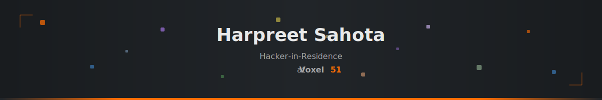

  
  
  
  
  
  

---

### Hey, I'm Harpreet 👋

I'm a **Hacker-in-Residence** at [**Voxel51**](https://voxel51.com), building integrations, dataset importers, plugins, and zoo model implementations for [**FiftyOne**](https://github.com/voxel51/fiftyone) — the open-source platform for visual AI.

My background spans actuarial sciences, biostatistics, and data science. I got into dev rel at Comet, Pachyderm, and Deci AI before joining Voxel51. I teach to learn — that's how I end up building Coursera courses, writing tutorials, and running workshops.

---

### What I'm working on

🔧 **FiftyOne ecosystem** — zoo model integrations (Qwen3-VL, Molmo2, SAM3, ColPali, Jina v4), dataset parsers across domains (retail, medical, robotics, remote sensing, document AI), and plugins for everything from annotation visualization to ComfyUI-style workflows.

🤖 **VLA & robotics** — RLDS/LeRobot dataset importers, proprioceptive data visualization, and building the data foundations for vision-language-action models.

🧊 **3D vision** — FO3D format pipelines, point cloud integrations (Utonia, Uni3D), 3D Gaussian Splatting rendering, and multi-camera retail scene reconstruction.

📄 **Document AI** — visual document embeddings, OCR model integrations (MinerU, DeepSeek-OCR, olmOCR-2), and agentic routing workflows with FiftyOne.

---

### Stats

  
  

  

  

---

### Tech I work with

  
  
  
  
  
  
  
  

---

  

